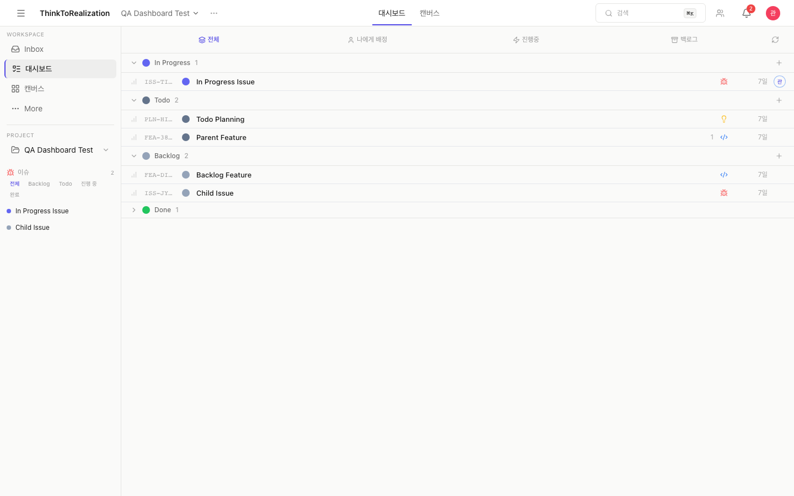
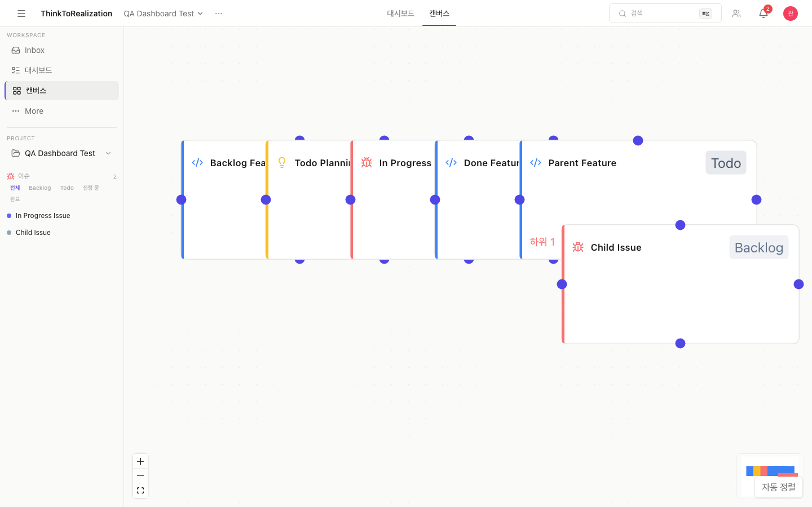
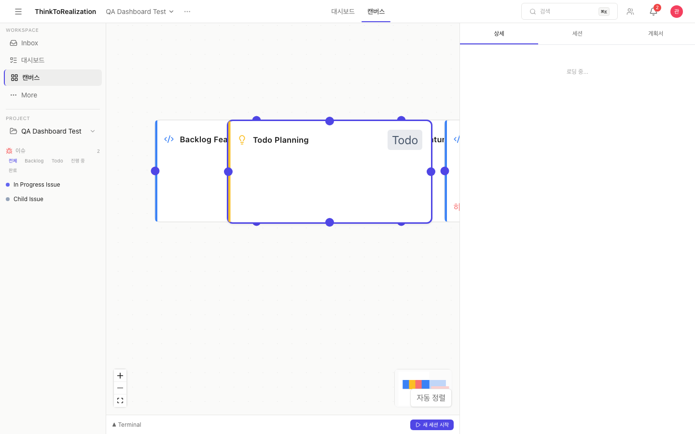
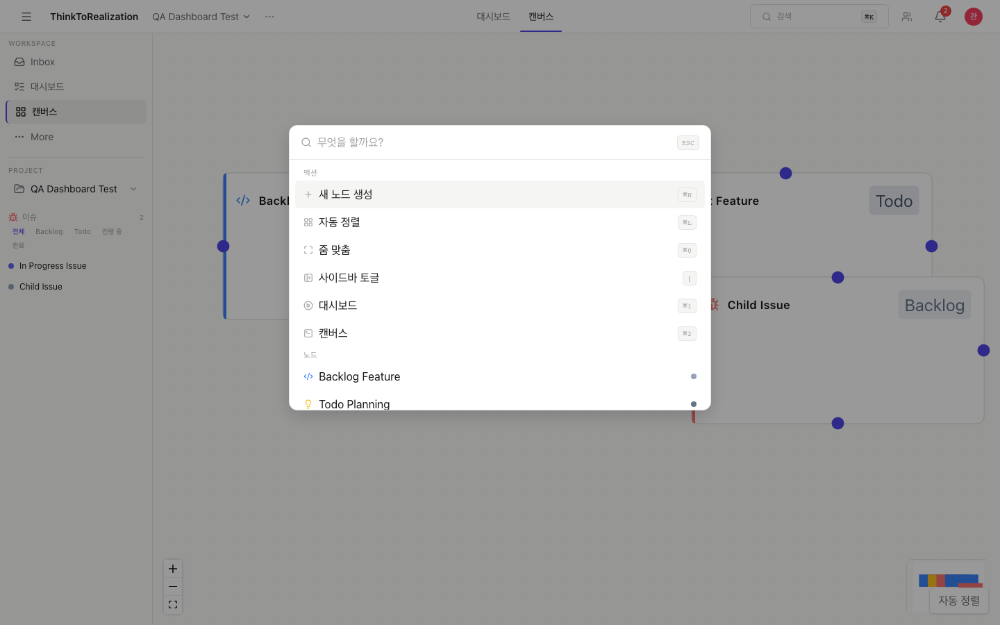

# DevFlow

AI 에이전트(Claude CLI)로 개발할 때의 사고 흐름을 캔버스에서 시각화하고 관리하는 로컬 웹앱.

작업 노드에 터미널 세션을 연결하면 세션 시작/종료에 따라 노드 상태가 자동으로 바뀌고, 파일 변경이 기록되고, 전체 흐름이 그래프로 그려진다. 설계부터 구현까지 Claude CLI와의 vibe coding으로 만들었다.

## 화면

### 대시보드
상태별로 작업 노드를 묶어서 보여준다. 필터링, 노드 생성, 상태 확인을 여기서 한다.



### 캔버스
작업 노드를 그래프로 배치하고 관계를 연결한다. 줌 레벨에 따라 노드의 표시 정보가 달라진다.



### 사이드 패널
노드를 클릭하면 상세 정보, 세션 이력, 계획서를 볼 수 있다. 3단계 너비(닫힘/40%/80%)로 조절 가능.



### 커맨드 팔레트
`Cmd+K`로 열고, 노드 검색이나 액션 실행을 한다.



## 만들게 된 배경

Claude CLI로 개발하다 보면 컨텍스트가 흩어진다. 어떤 작업이 어디까지 진행됐는지, 세션에서 뭘 했는지, 파일이 뭐가 바뀌었는지. 이걸 수동으로 추적하는 게 비효율적이라 느껴서, 아예 세션 자체를 추적하고 상태를 자동 관리하는 시스템을 만들었다.

## 주요 기능

- 캔버스에서 작업 노드를 만들고, 노드에 터미널 세션을 붙여서 작업
- 세션 시작하면 backlog → in_progress, 완료하면 → done으로 상태 자동 전이
- 세션 중 변경된 파일을 감지해서 세션에 자동으로 매핑
- 세션이 비정상 종료돼도 서버 재시작 시 자동 복구
- 수동으로 상태를 바꿀 수도 있는 이중 트랙 상태 머신 (자동 + 수동)

## AI-First 개발 방식

이 프로젝트 자체가 AI와의 협업 방식에 대한 실험이다.

CLAUDE.md에 데이터 모델, 상태 전이 규칙, API 스펙, WebSocket 메시지 포맷을 전부 구조화해서 넣었다. AI가 단편적인 코드 조각이 아니라, 프로젝트 전체 맥락 안에서 일관된 코드를 생성하도록 컨텍스트를 설계한 것. 프롬프트 하나하나가 아니라 프로젝트 단위로 컨텍스트를 엔지니어링했다.

AI가 만든 코드가 실제로 도는지는 Playwright 테스트(235개)로 잡는다. 빌드 → 테스트 → 실패 시 수정 루프를 매 작업마다 돌린다.

## 아키텍처

```
Browser
├── Canvas (xyflow 그래프)
├── Dashboard
└── Terminal (xterm.js)
    │
    ├── REST API ──→ Next.js (port 3000) ──→ Prisma ──→ SQLite / PostgreSQL
    │
    └── WebSocket ──→ WS Server (port 3001, 별도 프로세스)
                      ├── PTY Manager (node-pty, 노드별 터미널)
                      ├── Session Manager (세션 생명주기)
                      ├── State Machine (상태 자동 전이)
                      ├── File Watcher (파일 변경 감지)
                      └── Recovery Manager (크래시 복구)
```

Next.js와 WebSocket 서버가 분리되어 있다. 터미널 I/O는 키 입력마다 발생하는 고빈도 양방향 통신인데, 이걸 HTTP 요청으로 처리하면 지연도 생기고 클라우드 API를 쓸 경우 비용도 든다. 그래서 로컬 WebSocket으로 PTY 프로세스에 직접 연결하는 구조를 택했다. 터미널 데이터는 React 상태 관리를 거치지 않고 EventEmitter로 xterm에 바로 쏜다.

## 기술 스택

| 영역 | 기술 |
|------|------|
| 프레임워크 | Next.js 14 (App Router) |
| 실시간 통신 | WebSocket (ws) + node-pty |
| DB | Prisma + SQLite(로컬) / PostgreSQL(프로덕션) |
| 상태관리 | Zustand v5 |
| 캔버스 | @xyflow/react + dagre |
| 검증 | Zod |
| 테스트 | Playwright |
| 인증 | iron-session + bcrypt |
| 배포 | Vercel + Supabase |

## 프로젝트 구조

```
server/                  # WebSocket 서버 (독립 프로세스)
├── ws-server.ts         # 연결 관리, 이벤트 중계
├── terminal/            # PTY 생명주기, 출력 캡처
├── events/              # 이벤트 버스
├── session/             # 세션 시작/종료/재개
├── state/               # 이중 트랙 상태 머신
├── file-watcher/        # chokidar 기반 파일 변경 감지
└── recovery/            # 세션 복구

src/
├── app/api/             # REST API (49개 라우트)
├── components/          # React 컴포넌트 (61개)
├── stores/              # Zustand 스토어 4개
└── lib/                 # Zod 스키마, 인증, 유틸리티

e2e/                     # Playwright E2E 테스트 (26파일, 235케이스)
prisma/                  # 14개 모델, 시드 데이터
CLAUDE.md                # AI 개발 컨텍스트 명세서
```

## 실행

```bash
source ~/.nvm/nvm.sh && nvm use 22
npm install
npm run db:migrate && npm run db:seed
npm run dev        # Next.js(3000) + WebSocket(3001) 동시 실행
npx playwright test
```

## 설계 판단들

**CLAUDE.md를 컨텍스트로 쓴 이유** — AI에게 "버튼 만들어줘"가 아니라 "이 상태 머신 규칙에 맞는 API를 만들어줘"라고 시킬 수 있어야 했다. 그래서 데이터 모델, 전이 규칙, API 컨트랙트를 한 파일에 구조화해서 매 세션마다 컨텍스트로 넣었다. 결과적으로 300줄짜리 명세서가 됐는데, 이게 있으면 AI가 프로젝트 규칙을 이해한 상태에서 코드를 짜기 때문에 일관성이 확 올라간다.

**로컬 소켓을 쓴 이유** — 터미널 키 입력을 매번 클라우드로 보내면 레이턴시도 문제고 과금도 문제다. node-pty로 로컬에서 PTY 프로세스를 직접 관리하면 둘 다 해결된다.

**테스트를 이 정도로 붙인 이유** — AI가 만든 코드는 얼핏 돌아가는 것 같아도 엣지 케이스에서 깨지는 경우가 많다. 상태 전이가 맞는지, 크로스 프로젝트 제약이 지켜지는지, 이런 건 실제 DB에 넣고 돌려봐야 안다. 그래서 mock 없이 실제 DB 대상으로 E2E를 돌린다.

**상태 머신을 이중 트랙으로 만든 이유** — 세션 이벤트에 따른 자동 전이만으로는 실제 워크플로우를 못 커버한다. 끝난 작업을 다시 열거나 단계를 건너뛰는 경우가 있어서, 수동 오버라이드 트랙을 따로 뒀다. 전이는 전부 트랜잭션 안에서 처리하고 로그를 남긴다.
